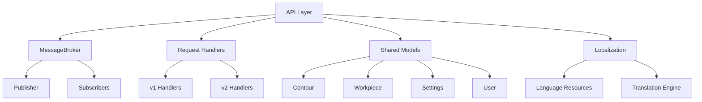

# API Module

## Overview

The API module provides the communication and integration layer for the glue dispensing system. It includes the MessageBroker for pub/sub messaging, request handling infrastructure, shared data models, and localization support.

## Architecture



## Core Components

### 1. MessageBroker

**File**: `MessageBroker.py`

Singleton publish-subscribe messaging system enabling decoupled communication between components.

#### Initialization

```python
broker = MessageBroker()  # Returns singleton instance
```

#### Key Features

- **Singleton Pattern**: Single broker instance across application
- **Weak References**: Automatic cleanup of dead subscribers
- **Error Isolation**: Subscriber errors don't affect other subscribers
- **Thread-Safe**: Safe for multi-threaded environments

#### Methods

##### subscribe(topic, callback)
Subscribe to a topic with a callback function.

**Parameters**:
- `topic` (str): Topic name to subscribe to
- `callback` (Callable): Function to call when message published

**Example**:
```python
def handle_message(data):
    print(f"Received: {data}")

broker.subscribe("system/state", handle_message)
```

**Automatic Cleanup**:
- Uses weak references to avoid keeping objects alive
- Dead references automatically removed
- Callbacks can be bound methods or functions

##### unsubscribe(topic, callback)
Manually unsubscribe from a topic.

**Parameters**:
- `topic` (str): Topic name
- `callback` (Callable): Callback to remove

**Example**:
```python
broker.unsubscribe("system/state", handle_message)
```

##### publish(topic, message)
Publish a message to all subscribers of a topic.

**Parameters**:
- `topic` (str): Topic name
- `message` (Any): Message data to publish

**Example**:
```python
broker.publish("system/state", {"state": "running", "progress": 50})
```

**Behavior**:
- Calls all live subscribers with message
- Continues on subscriber errors (isolated failures)
- Logs successful and failed callback invocations
- Automatically cleans up dead references

##### request(topic, message, timeout=1.0)
Synchronous request-response pattern.

**Parameters**:
- `topic` (str): Request topic
- `message` (Any): Request data
- `timeout` (float): Response timeout in seconds

**Returns**: First non-None response from subscribers

**Example**:
```python
response = broker.request("system/config", {"key": "robot_ip"}, timeout=2.0)
```

##### get_subscriber_count(topic)
Get number of active subscribers for a topic.

**Parameters**:
- `topic` (str): Topic name

**Returns**: int - Number of live subscribers

##### get_all_topics()
Get list of all topics with active subscribers.

**Returns**: List[str] - Topic names

##### clear_topic(topic)
Remove all subscribers from a topic.

**Parameters**:
- `topic` (str): Topic to clear

#### Common Topics

| Topic | Purpose | Message Type |
|-------|---------|--------------|
| `system/state` | System state updates | dict with state info |
| `vision-system/state` | Vision system state | VisionSystemState |
| `robot/state` | Robot state updates | RobotServiceState |
| `vision-system/contours` | Detected contours | List of contours |
| `vision-system/brightness-region` | Brightness adjustment | dict with region |
| `robot/trajectory/updateImage` | Trajectory visualization | dict with image |
| `glue-spray-app/mode` | Application mode change | str mode name |

### 2. API v1 (Legacy)

**Directory**: `v1/`

Traditional request-response API with direct handler invocation.

#### Components

##### Constants
**File**: `v1/Constants.py`

Defines API endpoints and constants.

##### Request
**File**: `v1/Request.py`

Request data structure.

```python
class Request:
    def __init__(self, endpoint, params=None):
        self.endpoint = endpoint
        self.params = params or {}
```

##### Response
**File**: `v1/Response.py`

Response data structure.

```python
class Response:
    def __init__(self, success, data=None, message="", error=None):
        self.success = success
        self.data = data
        self.message = message
        self.error = error
```

##### RequestHandler
**File**: `v1/RequestHandler.py`

Routes requests to appropriate handlers.

##### RequestSender
**File**: `v1/RequestSender.py`

Helper for sending requests to the handler.

### 3. API v2 (Modern)

**Directory**: `v2/`

Enhanced API with improved error handling, validation, and type safety.

**Documentation**: 
- [v2/MIGRATION_GUIDE.md](./v2/MIGRATION_GUIDE.md)
- [v2/TESTING_GUIDE.md](./v2/TESTING_GUIDE.md)
- [v2/TROUBLESHOOTING_FAQ.md](./v2/TROUBLESHOOTING_FAQ.md)

#### Improvements Over v1

1. **Type Safety**: Pydantic models for request/response validation
2. **Error Handling**: Comprehensive error types and messages
3. **Validation**: Input validation before processing
4. **Testing**: Full test suite with mocks
5. **Documentation**: Detailed API documentation

#### Components

##### Constants
**File**: `v2/Constants.py`

API endpoints, error codes, and status codes.

##### Request/Response Models
**File**: `v2/Request.py`, `v2/Response.py`

Type-safe request and response models using Pydantic.

```python
from pydantic import BaseModel

class Request(BaseModel):
    endpoint: str
    params: dict = {}
    
class Response(BaseModel):
    success: bool
    data: dict = None
    message: str = ""
    error_code: str = None
```

##### Request Router
**File**: `v2/handlers/ModernRequestRouter.py`

Advanced routing with middleware support.

**Features**:
- Request validation
- Error handling middleware
- Logging middleware
- Handler registration
- Response formatting

#### Endpoints

Common endpoints in v2:

| Endpoint | Purpose | Parameters |
|----------|---------|------------|
| `/start` | Start dispensing operation | `debug` (bool) |
| `/stop` | Stop current operation | None |
| `/pause` | Pause operation | None |
| `/resume` | Resume operation | None |
| `/calibrate/camera` | Calibrate camera | None |
| `/calibrate/robot` | Calibrate robot | None |
| `/workpiece/create` | Create workpiece | Workpiece data |
| `/workpiece/list` | List workpieces | Filter parameters |
| `/settings/get` | Get settings | `key` (str) |
| `/settings/set` | Update settings | `key`, `value` |

### 4. Shared Models

**Directory**: `shared/`

Common data structures used across the application.

#### Contour Models

**File**: `shared/Contour.py`

```python
class Contour:
    """Represents a detected or defined contour"""
    def __init__(self, points, area=None, perimeter=None):
        self.points = points  # List of (x, y) coordinates
        self.area = area
        self.perimeter = perimeter
```

**File**: `shared/ContourStandartized.py`

Standardized contour representation with normalization.

#### Database

**Directory**: `shared/database/`

Database connection and query utilities.

#### DXF Processing

**Directory**: `shared/dxf/`

DXF file parsing and contour extraction.

#### Email

**Directory**: `shared/email/`

Email notification utilities.

#### Interfaces

**Directory**: `shared/interfaces/`

Abstract interfaces and protocols for type safety.

#### Settings

**Directory**: `shared/settings/`

Configuration models and management.

##### CameraSettings
**File**: `shared/settings/conreateSettings/CameraSettings.py`

Camera configuration model.

**Methods**:
- `get_camera_index()`: Get camera device index
- `get_camera_width()`: Get image width
- `get_camera_height()`: Get image height
- `get_skip_frames()`: Get frame skip count
- `get_brightness_auto()`: Check if auto brightness enabled
- `get_contour_detection()`: Check if contour detection enabled
- `get_capture_pos_offset()`: Get capture position Z-offset

##### GlueSettings
Configuration for glue application parameters.

#### User Management

**Directory**: `shared/user/`

User authentication and authorization.

#### Workpiece Management

**Directory**: `shared/workpiece/`

Workpiece data models and services.

**File**: `shared/workpiece/WorkpieceService.py`

```python
class WorkpieceService:
    def loadAllWorkpieces(self) -> List[Workpiece]:
        """Load all workpieces from database"""
        
    def loadWorkpiece(self, workpiece_id: str) -> Workpiece:
        """Load specific workpiece"""
        
    def saveWorkpiece(self, workpiece: Workpiece) -> bool:
        """Save workpiece to database"""
        
    def deleteWorkpiece(self, workpiece_id: str) -> bool:
        """Delete workpiece from database"""
```

### 5. Localization

**Directory**: `localization/`

Multi-language support for the application.

**Documentation**: [localization/MIGRATION_GUIDE.md](./localization/MIGRATION_GUIDE.md)

#### Language Resource Loader

**File**: `localization/LanguageResourceLoader.py`

Loads translation resources from language files.

**Supported Languages**:
- English (en)
- Bulgarian (bg)
- German (de)
- [Add more as configured]

#### Language Files

**Directory**: `localization/languages/`

JSON files with translations for each language.

**Structure**:
```json
{
  "common": {
    "start": "Start",
    "stop": "Stop",
    "cancel": "Cancel"
  },
  "errors": {
    "connection_failed": "Connection failed"
  },
  "messages": {
    "operation_complete": "Operation completed successfully"
  }
}
```

#### Usage

```python
from shared.localization.LanguageResourceLoader import LanguageResourceLoader

loader = LanguageResourceLoader()
loader.set_language('en')

# Get translated text
text = loader.get('common.start')  # Returns "Start"
```

## Communication Patterns

### Publish-Subscribe

Used for event broadcasting and state updates.

```python
# Publisher
broker.publish("system/state", {"state": "running"})

# Subscriber
def on_state_change(state_data):
    print(f"New state: {state_data['state']}")
    
broker.subscribe("system/state", on_state_change)
```

### Request-Response

Used for synchronous operations requiring immediate results.

```python
# Via MessageBroker
response = broker.request("config/get", {"key": "robot_ip"}, timeout=2.0)

# Via shared handlers
from shared.v2.handlers.ModernRequestRouter import RequestRouter

router = RequestRouter()
result = router.handle_request(request)
```

### Command Pattern

Used for executing operations via API.

```python
from shared.v1.Request import Request
from shared.v1.RequestSender import RequestSender

sender = RequestSender(request_handler)
request = Request(endpoint="/start", params={"debug": False})
response = sender.send(request)
```

## Error Handling

### API v1 Error Response

```python
{
    "success": False,
    "error": "Camera not calibrated",
    "data": None,
    "message": ""
}
```

### API v2 Error Response

```python
{
    "success": False,
    "error_code": "CAMERA_NOT_CALIBRATED",
    "error_message": "Camera calibration required before operation",
    "data": None,
    "message": "",
    "timestamp": "2025-11-08T12:00:00Z"
}
```

## Configuration

### API Version Selection

Set in `main.py`:

```python
API_VERSION = 2  # Use 1 for v1, 2 for v2
```

### MessageBroker Configuration

No explicit configuration needed - uses singleton pattern with automatic initialization.

## Testing

### API v2 Tests

**Directory**: `v2/tests/`

Run tests:
```bash
python -m pytest shared/v2/tests/
```

### Test Coverage

- Request validation
- Response formatting
- Error handling
- Handler routing
- Middleware execution

## Migration from v1 to v2

See [v2/MIGRATION_GUIDE.md](./v2/MIGRATION_GUIDE.md) for detailed migration instructions.

### Key Changes

1. **Request/Response Models**: Now use Pydantic for validation
2. **Error Codes**: Structured error codes instead of free-form messages
3. **Handler Registration**: Explicit handler registration required
4. **Validation**: Automatic input validation
5. **Type Safety**: Full type hints and validation

### Migration Example

**v1 Code**:
```python
request = Request("/start", {"debug": True})
response = handler.handle(request)
```

**v2 Code**:

```python
from shared.v2.models.Request import StartRequest

request = StartRequest(debug=True)
response = router.handle_request(request)
```

## Performance Considerations

### MessageBroker

- **Weak References**: Minimal memory overhead
- **Lazy Cleanup**: Dead references cleaned during publish
- **No Polling**: Event-driven, no CPU waste

### Request Handling

- **Async Support**: v2 supports async handlers
- **Middleware**: Efficient request processing pipeline
- **Caching**: Response caching for idempotent requests

## Security

### Input Validation

All v2 requests validated using Pydantic schemas.

### Authentication

User authentication handled in `shared/user/` module.

### Authorization

Role-based access control for API endpoints.

## Troubleshooting

See [v2/TROUBLESHOOTING_FAQ.md](./v2/TROUBLESHOOTING_FAQ.md) for common issues and solutions.

### Common Issues

**MessageBroker not receiving messages**:
- Check topic name spelling
- Verify subscriber is still alive (not garbage collected)
- Check for errors in subscriber callback

**API request failing**:
- Validate request format
- Check endpoint name
- Verify all required parameters provided
- Review error response for details

## Dependencies

- **typing**: Type hints
- **weakref**: Weak references for MessageBroker
- **logging**: Logging infrastructure
- **pydantic**: v2 request/response validation (API v2 only)

## Related Documentation

- [Main System README](../docs/README.md)
- [GlueDispensingApplication](../GlueDispensingApplication/README.md)
- [UI Documentation](../pl_ui/README.md)
- [API v2 Migration Guide](./v2/MIGRATION_GUIDE.md)

---

**Module Version**: 2.0
**Last Updated**: 2025-11-08
